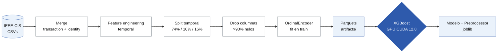
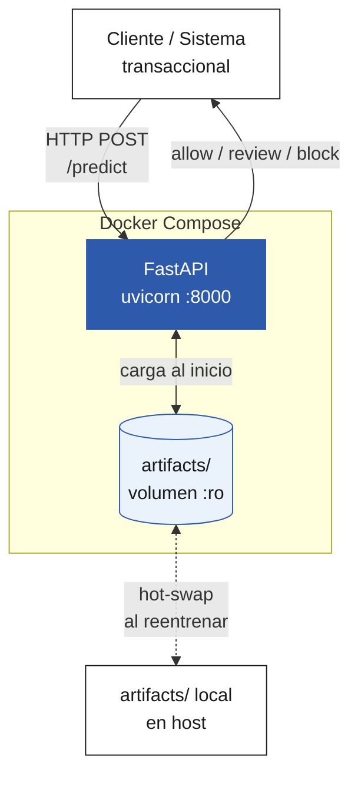
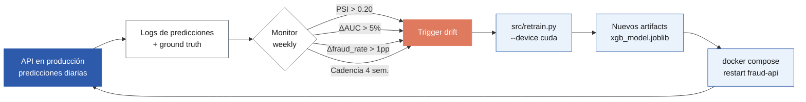

# Skill: Diagramas de arquitectura

## Propósito

Generar tres diagramas que documentan el sistema:

1. **Pipeline de datos y modelado** — desde los CSVs hasta el modelo entrenado.
2. **Arquitectura de despliegue** — Docker compose, API REST, volumen de artifacts.
3. **Loop adaptativo** — monitoreo de drift, trigger, reentrenamiento, hot-swap del modelo.

Cada diagrama se entrega en **dos formatos**:

- **Mermaid** (`.md`): para edición rápida y visualización en GitHub/GitLab
- **TikZ** (`.tex`): para inclusión directa en el informe LaTeX

## Inputs (leer si están disponibles)

- `README.md` — para entender el flujo actual
- `docker-compose.yml` — componentes del despliegue
- `src/api/main.py` — endpoints expuestos
- `src/retrain.py` — pipeline de reentrenamiento
- `notebooks/04_drift_analysis.py` — triggers definidos

## Output

```
docs/diagramas/
├── 01-pipeline-datos.md       # Mermaid
├── 01-pipeline-datos.tex      # TikZ
├── 02-despliegue.md
├── 02-despliegue.tex
├── 03-loop-adaptativo.md
└── 03-loop-adaptativo.tex
```

## Diagrama 1: Pipeline de datos y modelado

**Mermaid** (en `01-pipeline-datos.md`):



**TikZ** (en `01-pipeline-datos.tex`): generar versión equivalente con `\usepackage{tikz}`
y `\usetikzlibrary{positioning,shapes.geometric,arrows.meta}`. Usar nodos rectangulares
con esquinas redondeadas (`rounded corners=2pt`), líneas finas, paleta de 3 colores
(neutro, azul acento, gris).

## Diagrama 2: Arquitectura de despliegue

**Mermaid**:



**TikZ**: equivalente en LaTeX, manteniendo la separación visual del subgraph
(rectángulo con borde punteado y label "Docker Compose").

## Diagrama 3: Loop adaptativo

**Mermaid**:



**TikZ**: equivalente, mantener el ciclo cerrado visualmente.

## Reglas de diseño

- **Paleta limitada** a 3-4 colores: neutro (`#FFFFFF`/`#EAF2FB`), azul acento (`#2E5AAC`),
  gris (`#6C757D`), y un naranja para alertas/triggers (`#E07A5F`).
- **Tipografía**: sin etiquetas en mayúsculas, máximo 3 palabras por nodo cuando se pueda.
- **Sin emojis** en ningún diagrama.
- **Líneas**: finas, sin sombras, sin gradientes.
- **Etiquetas de aristas**: solo cuando aporten información (umbrales, condiciones).
  Nunca solo "yes/no".
- **TikZ**: usar `node distance=1.5cm`, fuente `\small`, sin colores fluo.

## Cómo incluir en el informe LaTeX

Indicar al usuario que en `main.tex` puede usar:

```latex
\begin{figure}[h]
  \centering
  \input{../diagramas/02-despliegue.tex}
  \caption{Arquitectura de despliegue del servicio de inferencia.}
  \label{fig:despliegue}
\end{figure}
```

## Flujo del agente

1. Crear `docs/diagramas/` si no existe.
2. Generar los 6 archivos (3 Mermaid + 3 TikZ).
3. Verificar que cada Mermaid es renderizable (sintaxis válida).
4. Verificar que cada TikZ es compilable (al menos sintácticamente).
5. Imprimir al usuario:
   - Lista de archivos creados
   - Cómo ver los Mermaid (GitHub renderiza inline, o usar https://mermaid.live)
   - Cómo incluir los TikZ en el informe (ejemplo `\input{}`)
